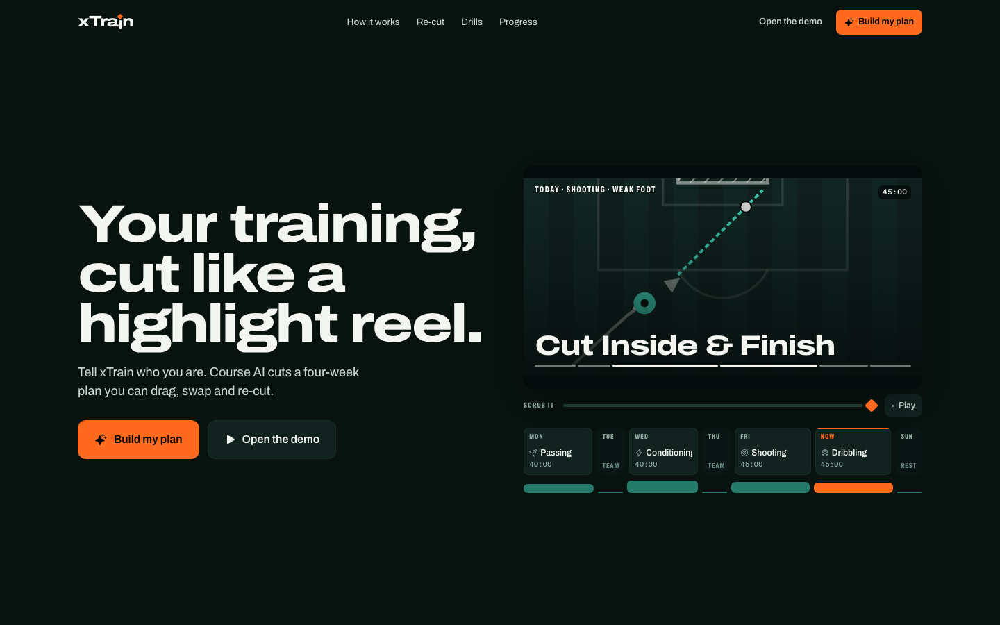
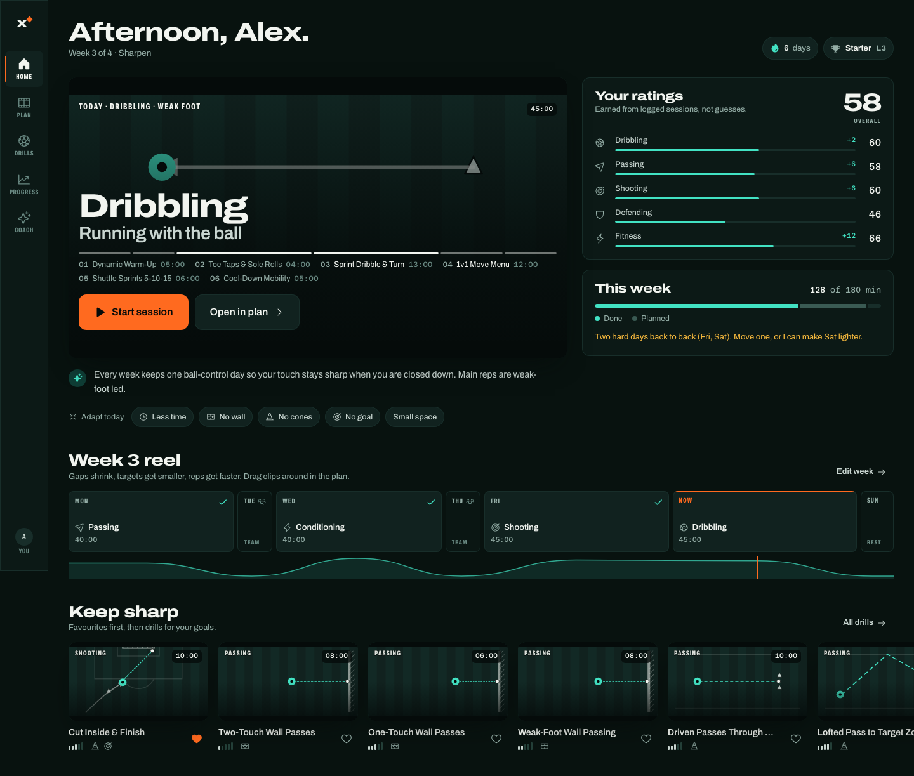
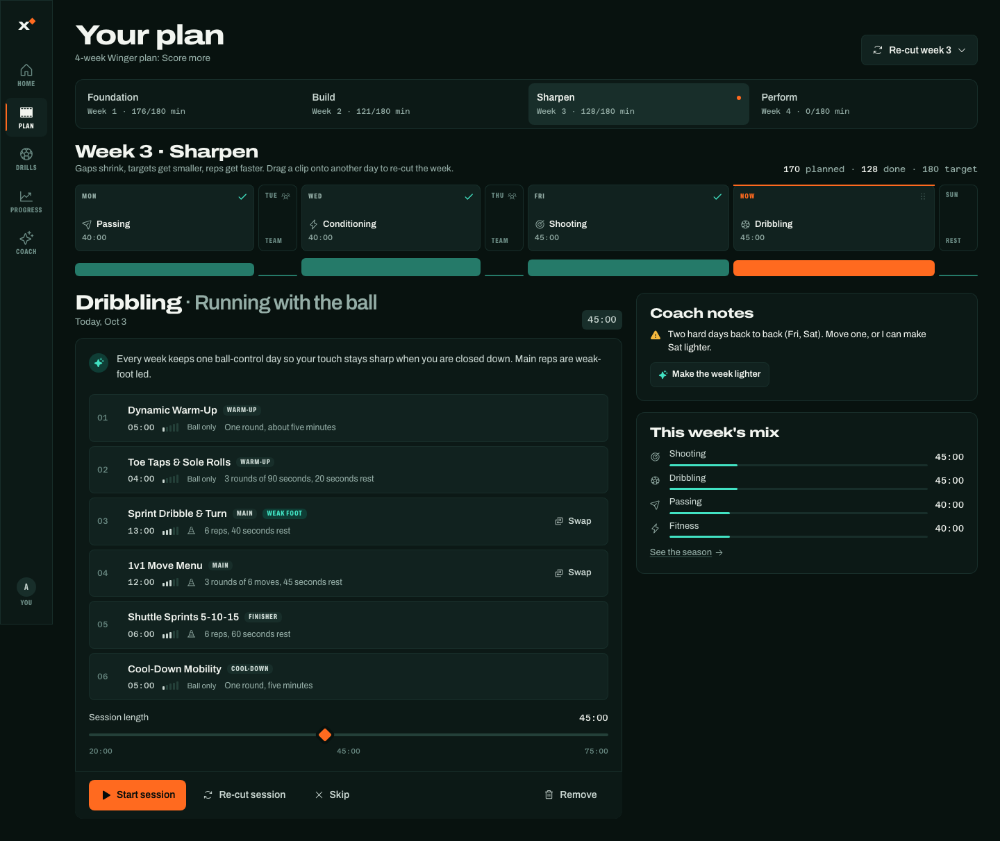
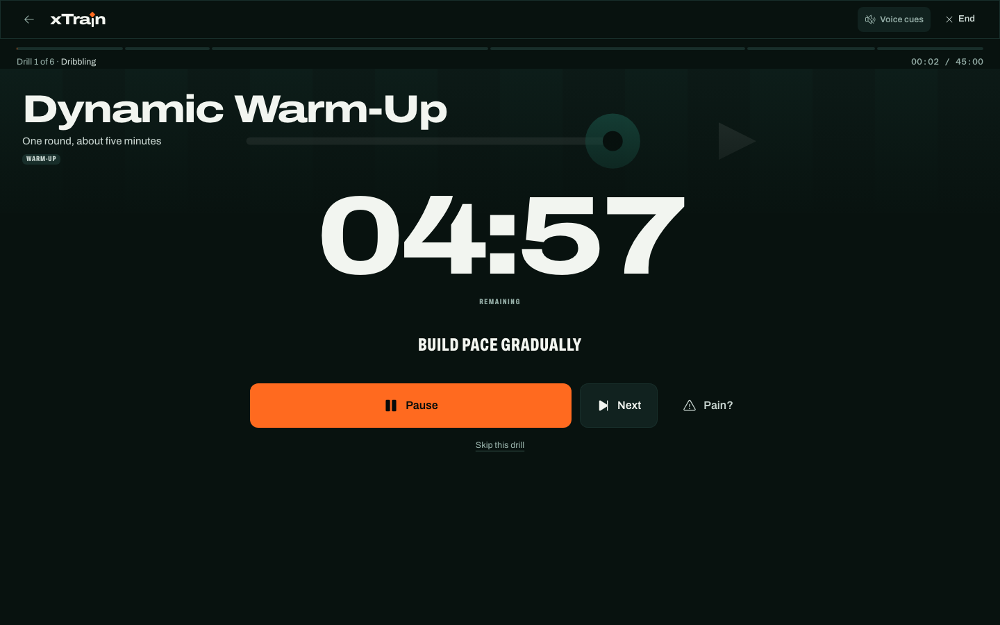
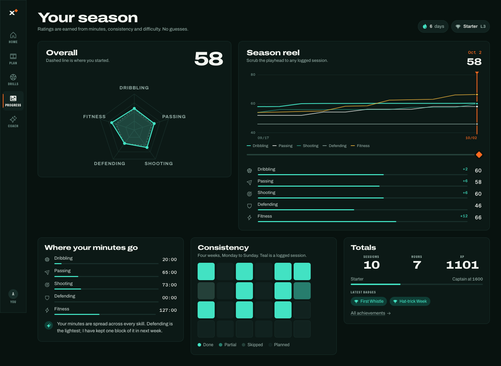

# xTrain

**Your training, cut like a highlight reel.** xTrain turns a short signup into a four-week solo soccer training plan the player can drag, swap, shorten and re-cut, then guides each session drill by drill and tracks honest, behaviour-derived ratings.



| | |
| --- | --- |
| Live site | https://xtrain-pi.vercel.app |
| Source | https://github.com/ivannadil/xTrain |
| Claude artifact | https://claude.ai/artifact/1dEf752dbJvqghepzFaW5X (private until shared) |
| Version | 0.1.0, 2026-10-03 ([changelog](CHANGELOG.md)) |
| Status | Working prototype on synthetic data; rule-based planner; no backend yet |
| Stack | Vite, React 19, TypeScript, Tailwind v4, Motion, dnd-kit, Playwright |
| Docs | [How it was built](docs/PROCESS.md) · [Architecture](docs/ARCHITECTURE.md) · [Design system](DESIGN.md) · [Product truth](PRODUCT.md) · [Research](docs/research/) |

## Why

Youth players who cannot afford private coaching get generic drill videos or a fixed plan they cannot change. Every AI training app we studied (25 of them, see [the research](docs/research/competitors.md)) either drops a fixed plan or offers "regenerate" as the only edit. None lets a player move their week around. xTrain's thesis is that the plan belongs to the player: every AI decision is editable, reversible, and explained in one sentence.

## What it does



- **Signs you up in twelve questions**: name, age (guardian step under 13), position, level, stronger foot, up to two goals, team days, solo days and minutes, space, kit, body check. Each question says why it is asked.
- **Cuts a plan while you watch**: the generation screen shows the planner's real steps (blocking team days, choosing from the drills that fit your kit, putting your first goal on the freshest day) and reveals week one with "because you said" coach notes.
- **Lets you re-cut it**: the week is a filmstrip where each clip's width is its minutes. Drag a session to another day; xTrain warns before you stack two hard days or land on a team day and offers "move and make it light". Swap drills for same-skill alternatives, scrub session length, re-cut a session or the week, skip, remove, add. Every edit has Undo.



- **Explains itself**: every session carries a one-line reason, and the coach chat answers "why is Wednesday conditioning?" from the actual plan, adapts today's session to missing kit, or makes the week lighter.
- **Runs the session on a propped phone**: a timer you can read from the penalty spot, one cue at a time, rest that counts itself down, a pain flag, then a three-tap log (effort, feel, pain).



- **Earns ratings, never guesses them**: five skills from 0 to 100 move only with logged minutes, consistency and difficulty. A radar shows where you started, a season chart scrubs to any logged day, a consistency grid shows the honest picture, and badges carry real progress.



## Design

The visual world is "the highlight reel": the skill-edit grammar teenagers watch daily. Letterboxed clips with authored SVG pitch plans, a week filmstrip with an orange playhead on "now", a green-teal floodlit ink ramp, wide Archivo display type with condensed caps captions, Azeret Mono timecodes. Orange is spent only on pressable controls and the playhead; teal is Course AI's voice and data. Navigation and filters are hard cuts; eased, speed-ramped motion is reserved for authored moments, with a complete reduced-motion path. The system is recorded in [DESIGN.md](DESIGN.md); the reasoning is in [docs/PROCESS.md](docs/PROCESS.md).

## Run it

```bash
npm install
npm run dev          # http://127.0.0.1:5173
npm run test         # Playwright flow tests, desktop + phone
npm run typecheck
npm run build        # dist/ for Vercel (path routing, see vercel.json)
vercel --prod        # deploy the current checkout to production
npm run build:artifact   # dist-artifact/ for the Claude artifact host (hash routing)
```

Routes: `/` landing, `/start?fresh=1` new player, `/app` demo player (Alex, winger, week 3 of 4). Data persists in the browser; "Reset demo player" lives in `/app/profile`.

## Repository map

```
src/data        types, 30 authored drills with diagram specs, badges, demo seed
src/lib         courseAI (planner + edits + ratings), coachBrain, store, hooks, motion
src/components  PitchDiagram, Filmstrip, Charts, RatingBars, DrillCard, Toaster, ui kit, AppShell
src/pages       Landing, Onboarding, Home, Plan, Drills, DrillDetail, Session, Progress, Achievements, Coach, Profile
tests           flow tests and the screenshot capture spec
docs            PROCESS, ARCHITECTURE, research reports, screenshots
```

## Verification for 0.1.0

| Check | Result |
| --- | --- |
| Playwright flow tests (desktop and phone projects) | 23 passed, 1 skipped by design |
| Route captures with horizontal-overflow assertions | 39 captures, zero overflow |
| Design detector | 0 findings |
| Finish review against the direction contract | 8-item fix list, all resolved |

## What is synthetic

The demo player, their logged sessions, badge unlock percentages and coaching copy. No real users, prices, testimonials or camera-based coaching are claimed anywhere; the landing page's roadmap says what is real today.

## Versioning and releases

Pre-1.0, every major change to what xTrain does or how it looks ships as a new minor version (0.2.0, 0.3.0). Fixes that do not change behaviour are patches. 1.0.0 is the first version a real player trains with.

A release is cut in five steps: update [CHANGELOG.md](CHANGELOG.md) and add `docs/releases/vX.Y.Z.md` with fresh screenshots; bump `version` in `package.json`; commit and tag (`git tag -a vX.Y.Z`); push with tags; deploy with `vercel --prod` and publish the GitHub release from the tag using the release notes file. Release history: [docs/releases](docs/releases/).

## Author

Ishan Vannadil. Built in October 2026 as the web prototype for a team soccer-training startup; the product requirements document that informed it is summarised in [PRODUCT.md](PRODUCT.md). MIT licensed.
